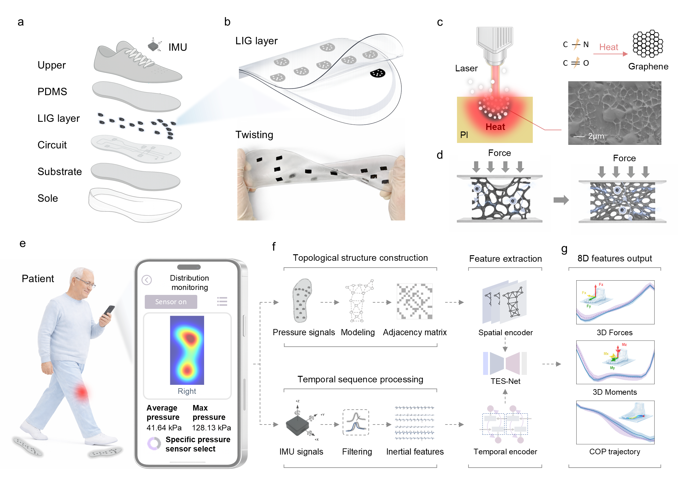

# SmartFlex:Intelligent wearables with topology-enhanced spatiotemporal modeling enable continuous gait kinetics reconstruction



## Repository Structure

- `train/model.py`: topology-enhanced LSTM model and training workflow.
- `predict/predict.py`: prediction from a trained model.
- `adapt/adapt.py`: pseudo-label generation and fine-tuning for target-domain data.
- `visualize/visualization.py`: pressure heatmap visualization.
- `evaluate/metrics.py`: regression metrics for prediction CSV files.
- `data/`: data-format notes.
- `models/`: generated models are written here.
- `results/`: generated predictions, metrics, and figures are written here.

## Main Training Process

`train/model.py` performs the full process:

1. Read all training CSV files.
2. Extract 22 input channels:
   - IMU: `aX, aY, aZ, Gx, Gy, Gz`
   - pressure array: `F1` to `F16`
3. Extract 8 target variables:
   - `Fx, Fy, Fz, Mx, My, Mz, COPx, COPy`
4. Standardize inputs and outputs.
5. Pad variable-length sequences.
6. Build a pressure-topology encoder using a 16-sensor adjacency matrix.
7. Fuse pressure-topology features with IMU features.
8. Train a bidirectional LSTM and time-distributed output layer.
9. Save:
   - `model.keras`
   - `normalization_stats.npz`

## Pressure Heatmap

```bash
python visualize/visualization.py --input_csv path\to\sample.csv --output_png results/pressure_heatmap.png
```

The heatmap reconstructs a continuous plantar-pressure field from discrete sensor values using Gaussian kernel summation:

```text
P(x, y) = sum_i p_i * exp(-((x - x_i)^2 + (y - y_i)^2) / (2 * sigma^2))
```

Sensor columns are renamed from hardware-style labels such as `R2-C2` to sensor IDs `1` to `16`, then reordered before reconstruction. CSV files with direct `F1` to `F16` columns are also supported.

Useful options:

```bash
python visualize/visualization.py --input_csv sample.csv --frame 120 --output_png results/frame_120.png
python visualize/visualization.py --input_csv sample.csv --aggregate mean --sigma 0.12 --output_png results/mean_pressure.png
```

## Input CSV Format

Required input columns:

```text
aX,aY,aZ,Gx,Gy,Gz,F1,F2,F3,F4,F5,F6,F7,F8,F9,F10,F11,F12,F13,F14,F15,F16
```

For supervised training and evaluation, include:

```text
Fx,Fy,Fz,Mx,My,Mz,COPx,COPy
```

## Data Availability

Raw participant data, identifiable clinical records, private hardware logs, and final unpublished model weights are not included in this public repository.

## GitHub Upload Notes

For first-time GitHub users:

1. Open GitHub Desktop.
2. Select `File` -> `Add local repository`.
3. Select this repository folder.
4. If GitHub Desktop says it is not a repository, choose `create a repository`.
5. Enter a commit message such as `Initial public release`.
6. Click `Commit to main`.
7. Click `Publish repository`.
8. Suggested repository name: `wearable-insole-kinetics`.
9. Uncheck `Keep this code private`, then publish.

## Citation

Please cite the associated manuscript if you use this code. A draft citation file is provided in `CITATION.cff`.

## License

This project is released under the MIT License. See `LICENSE`.
